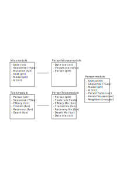

[](https://github.com/UofUEpi/epiworld/actions/workflows/ci.yml)

# epiworld

This C++ template-header-only library provides a general framework for epidemiologic simulation. The main features of the library are:

  1. Four key classes: `Model`, `Person`, `Tool`, and `Virus`.
  2. The model features a social networks of `Persons`.
  3. `Persons` can have multiple `Tools` as a defense system.
  4. `Tools` can reduce contagion rate, transmissibility, death rates, and improve recovery rates.
  5. `Viruses` can mutate (generating new variants).
  6. `Models` can feature multiple states, e.g., `HEALTHY`, `SUSCEPTIBLE`, etc.
  7. `Models` can have an arbitrary number of parameters.
  8. **REALLY FAST** About 6.5 Million person/day simulations per second.



# Hello world

Here is a simple SIRS model implemented with 

```cpp
#include "../include/epiworld/epiworld.hpp"

using namespace epiworld;

int main()
{

        // Creating a model
    Model<> model;

    // Adding the tool and virus
    Virus<> virus("covid 19");
    virus.set_post_immunity(1.0);
    model.add_virus_n(virus, 5);
    
    Tool<> tool("vaccine");
    model.add_tool(tool, .5);

    // Generating a random pop 
    model.pop_from_random(100000);

    // Initializing setting days and seed
    model.init(100, 123);

    // Running the model
    model.run();
    model.print();
  
}
```

And you should get something like the following:

```bash
Running the model...
_________________________________________________________________________
||||||||||||||||||||||||||||||||||||||||||||||||||||||||||||||||||||||||| done.

________________________________________________________________________________
SIMULATION STUDY

Population size    : 100000
Days (duration)    : 100 (of 100)
Number of variants : 1
Last run elapsed t : 280.00ms
Rewiring           : off

Virus(es):
 - covid 19 (baseline prevalence: 5 seeds)
Tool(s):
 - vaccine (baseline prevalence: 50.00%)

Model parameters:

Distribution of the population at time 100:
 - Total healthy (S)   :   99995 -> 97390
 - Total recovered (S) :       0 -> 2554
 - Total infected (I)  :       5 -> 56
 - Total removed (R)   :       0 -> 0

(S): Susceptible, (I): Infected, (R): Recovered
________________________________________________________________________________
```

Which took about 0.280 seconds.

## Tools

## Contagion

Susceptible individuals can acquire a virus from any of their infected connections. The probability that susceptible individual `i` gets the virus `v` from individual `j` depends on how three things:

1. The transmissibility of the virus, Pv in [0,1],
2. The contagion reduction factor of `i`, Cr in [0,1], and
3. The host's transmission reduction factor, Tr [0,1].

The last two are computed from `i` and `j`'s tools. Ultimately, the probability of `i` getting virus `v` from `j` equals:

```
P(Virus v) = Pv * (1 - Cr) *(1 - Tr) 
```

Nonetheless, the default behavior of the simulation model is to assume that individuals can acquire only one disease at a time, if any. This way, the actual probability is:

```
P(Virus v| at most one virus) = Prcond(i,v,j)
```

The latter is calculated using Bayes' rule

```
Prcond(i,v,j) = P(at most one virus|Virus v) * P(Variant v) / P(at most one virus)
              = P(Only Virus v)/P(Virus v) * P(Virus v) / P(at most one virus)
              = P(Only Virus v)/P(at most one virus)
```

Where

```
P(Vnly Virus V)      = P(Virus V) * Prod(m!=V) (1 - P(Virus m))
P(at most one virus) = P(None) + Sum(k in viruses) P(Virus k) * Prod(m != k) (1 - P(Virus m))
P(None)              = Prod(k in Viruses) (1 - P(Virus k))
```

This way, viruses with higher transmissibility will be more likely to be acquired when competing with other variants.
