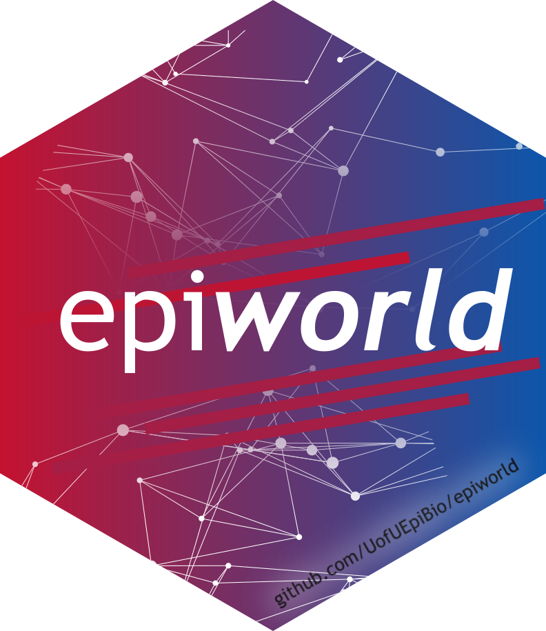

<div class="epiworld-hero epiworld-network-hero">
  <canvas class="epiworld-network-canvas" aria-hidden="true"></canvas>

  <div class="hero-text">
    <h1></h1>

    <p class="hero-tagline">
      A fast, general-purpose C++ framework for agent-based epidemiological simulation.
    </p>

    <div class="hero-badges">
      <span class="hero-badge">⚡ 150M+ agent·day/sec</span>
      <span class="hero-badge">📦 Header-only</span>
      <span class="hero-badge">🧬 Multi-pathogen</span>
      <span class="hero-badge">🌐 Network-aware</span>
    </div>

    <div class="hero-buttons">
      <a href="impl/" class="btn-primary">Get Started</a>
      <a href="https://github.com/UofUEpiBio/epiworld" class="btn-secondary">GitHub →</a>
    </div>
  </div>
</div>

<div class="lang-logos" markdown>
  <div class="lang-logos-row">
    <a href="https://github.com/UofUEpiBio/epiworld" class="lang-logo-card" aria-label="C++">
      
      <p class="lang-logo-title">C++</p>
      <p class="lang-logo-text">Freely available on GitHub, including the single header.</p>
    </a>
    <a href="https://github.com/UofUEpiBio/epiworldR" class="lang-logo-card" aria-label="R">
      
      <p class="lang-logo-title">R</p>
      <p class="lang-logo-text">Available both on GitHub and the Comprehensive R Archive Network (CRAN).</p>
    </a>
  </div>
</div>

## Quick Example

The `epiworld` library includes many pre-defined models. Here is an example using the Susceptible-Infected-Recovered model with a small-world network:

```cpp
#include "epiworld.hpp"

using namespace epiworld;

int main() {

    // Create a built-in SIR model
    epimodels::ModelSIR<> model(
        "COVID-19", // Virus name
        0.01,       // Initial prevalence
        0.1,        // Transmission rate
        0.3         // Recovery rate
    );

    // Generate a small-world contact network
    model.agents_smallworld(100000, 10, false, 0.01);

    // Run for 100 days with seed 122
    model.run(100, 122);
    model.print();

    return 0;
}
```

<div class="feature-grid" markdown>

<div class="feature-card" markdown>
<div class="feature-icon">⚡</div>

### Lightning Fast

Over 150 million agent × day simulations per second — built for
large-scale studies without sacrificing speed.
</div>

<div class="feature-card" markdown>
<div class="feature-icon">🧩</div>

### Fully Flexible

Define arbitrary states, viruses, tools, and update rules. Build
the exact model you need from composable primitives.
</div>

<div class="feature-card" markdown>
<div class="feature-icon">📦</div>

### Header-Only

Single-file include with zero external dependencies — just the
C++ standard library. Drop it in and go.
</div>

<div class="feature-card" markdown>
<div class="feature-icon">🌐</div>

### Network-Aware

Simulations run on contact networks with configurable topologies
including small-world, scale-free, and custom graphs.
</div>

<div class="feature-card" markdown>
<div class="feature-icon">🧬</div>

### Multi-Pathogen

Multiple viruses and tools can coexist in one simulation with
independent transmission and recovery dynamics.
</div>

<div class="feature-card" markdown>
<div class="feature-icon">📊</div>

### Rich Analytics

Built-in data collection, reproductive number tracking, generation
intervals, and likelihood-free inference (LFMCMC).
</div>

</div>

<div class="network-banner">
  
</div>

## Documentation Sections

<div class="grid cards" markdown>

-   :material-book-open-variant:{ .lg .middle } **Models**

    ---

    Browse all built-in compartmental models: SIR, SEIR, SIS, connected
    population variants, mixing models, and disease-specific models.

    [:octicons-arrow-right-24: View models](epiworld/modules.md)

-   :material-code-tags:{ .lg .middle } **API Reference**

    ---

    Complete class and function reference generated from the source code
    via Doxygen.

    [:octicons-arrow-right-24: API docs](api/index.md)

-   :material-cog:{ .lg .middle } **Implementation**

    ---

    Deep dives into library architecture, performance optimization,
    extending the library, queueing system, and more.

    [:octicons-arrow-right-24: Learn more](impl/index.md)

</div>

## Source Code

The epiworld source code is hosted at
[**UofUEpiBio/epiworld**](https://github.com/UofUEpiBio/epiworld) on GitHub.
