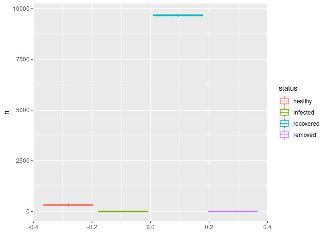

SIR Multiple Runs (b)
================

``` bash
./02b-sir_multiple_runs.o
```

    ## 
    ## ________________________________________________________________________________
    ## SIMULATION STUDY
    ## 
    ## Population size    : 10000
    ## Days (duration)    : 0 (of 60)
    ## Number of variants : 1
    ## Last run elapsed t : -
    ## Rewiring           : off
    ## 
    ## Virus(es):
    ##  - a virus (baseline prevalence: 10.00%)
    ## Tool(s):
    ##  - Immune system (baseline prevalence: 100.00%)
    ## 
    ## Model parameters:
    ##  - Immune contagion_reduction : 0.5000
    ##  - Immune recovery            : 0.5000
    ##  - Infectiousness             : 0.8000
    ##  - Post immunity              : 0.8000
    ## 
    ## Distribution of the population at time 0:
    ##  - Total healthy (S)   : 9000
    ##  - Total recovered (S) : 0
    ##  - Total infected (I)  : 1000
    ##  - Total removed (R)   : 0
    ## 
    ## (S): Susceptible, (I): Infected, (R): Recovered
    ## ________________________________________________________________________________
    ## 
    ## Starting multiple runs (100)
    ## _________________________________________________________________________
    ## _________________________________________________________________________
    ## ||||||||||||||||||||||||||||||||||||||||||||||||||||||||||||||||||||||||| done.
    ##  done.
    ## last run elapsed time : 0.00s
    ## total elapsed time    : 3.00s
    ## total runs            : 100
    ## mean run elapsed time : 0.03s

``` r
dat <- read.csv("02b-sir-multiple-runs.csv")
dat <- with(
  dat,
  rbind(
    data.frame(run_id = run_id, status = "healthy", n = healthy),
    data.frame(run_id = run_id, status = "infected", n = infected),
    data.frame(run_id = run_id, status = "recovered", n = recovered),
    data.frame(run_id = run_id, status = "removed", n = removed)
  ))
```

``` r
library(ggplot2)
ggplot(dat, aes(y = n, colour = status)) +
  geom_boxplot()
```

<!-- -->
