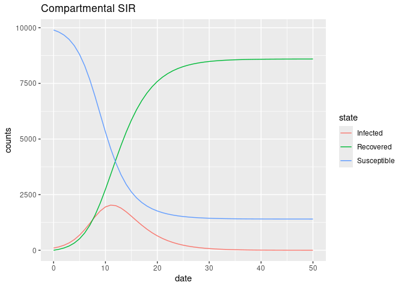
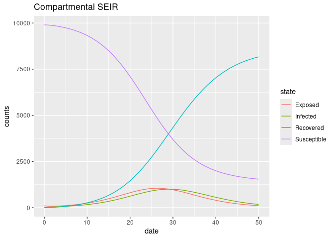
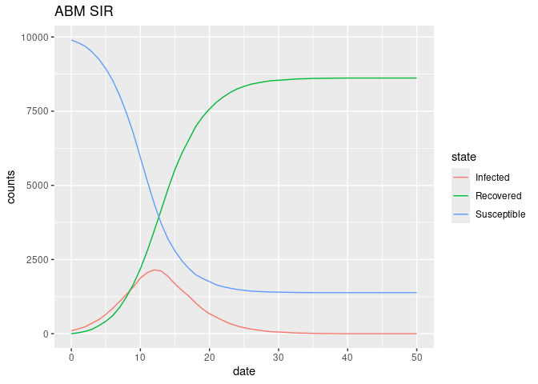
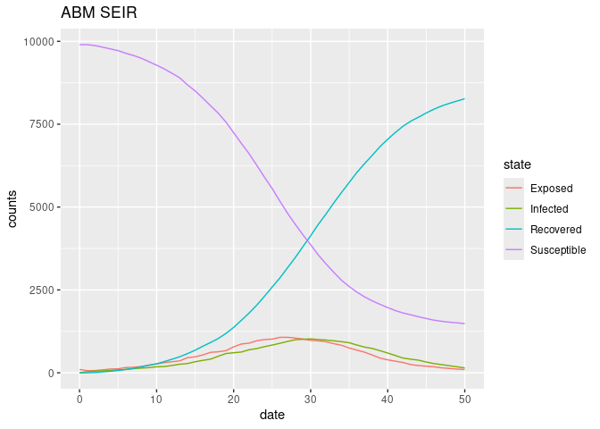
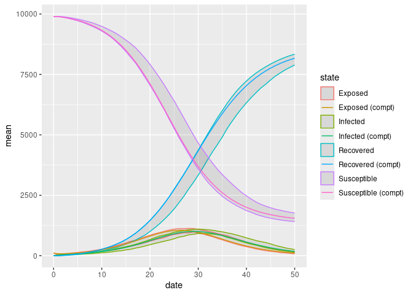

# General parameters

The following are parameters used for both ABM and Compartmental models.

``` r
EPI_BETA  <- 0.75
EPI_GAMMA <- 0.33
EPI_LATENCY <- 1/0.33
EPI_N     <- 10000
EPI_0     <- 0.01
EPI_NDAYS <- 50

Sys.setenv( # nolint
    EPI_BETA  = EPI_BETA,
    EPI_GAMMA = EPI_GAMMA,
    EPI_LATENCY = EPI_LATENCY,
    EPI_N     = EPI_N,
    EPI_0     = EPI_0,
    EPI_NDAYS = EPI_NDAYS
)
```

# Compartmental Models

## SIR Model

``` r
library(deSolve)
library(ggplot2)
library(data.table)

# Code from
# Chapter 2: SIR
# Book "Epidemics: Models and Data using R."
# By: Ottar N. Bjørnstad
sirmod <- function(t, y, parms) {

    # Pull state variables from the vector y
    S = y[1]
    I = y[2]
    R = y[3]
    
    # Pull parameter values from parms vector
    beta  = parms["beta"]
    mu    = parms["mu"]
    gamma = parms["gamma"]
    N     = parms["N"]
    
    # Define equations
    dS  = mu * (N - S) - beta * S * I/N
    dI  = beta * S * I/N - (mu + gamma) * I
    dR  = gamma * I - mu * R
    res = c(dS, dI, dR)
    
    # Return list of gradients
    list(res)

}

# Initial parameters
times <- seq(0, EPI_NDAYS, by = 1)
parms <- c(mu = 0, N = EPI_N, beta = EPI_BETA, gamma = EPI_GAMMA)
start <- c(S = EPI_N * (1 - EPI_0), I = EPI_N * EPI_0, R = 0)
```

``` r
out <- ode(y = start, times = times, func = sirmod, parms= parms)
out <- as.data.frame(out)
out <- rbind(
    with(out, data.table(date = time, state = "Susceptible", counts = S)),
    with(out, data.table(date = time, state = "Infected", counts = I)),
    with(out, data.table(date = time, state = "Recovered", counts = R))
)
```

Now we visualize the model

``` r
ggplot(out, aes(x = date, y = counts)) +
    geom_line(aes(colour = state)) +
    labs(title = "Compartmental SIR")
```



## SEIR Model

``` r
# Code adapted from
# Chapter 2: SIR
# Book "Epidemics: Models and Data using R"
# By: Ottar N. Bjørnstad
seirmod <- function(t, y, parms) {

    # Pull state variables from y vector
    S = y[1]
    E = y[2]
    I = y[3]
    R = y[4]
    
    # Pull parameter values from parms vector
    beta  = parms["beta"]
    mu    = parms["mu"]
    alpha = parms["alpha"]
    gamma = parms["gamma"]
    N     = parms["N"]
    
    # Define equations
    dS  = mu * (N - S) - beta * S * I/N - mu * S
    dE  = beta * S * I/N - (mu + alpha) * E
    dI  = alpha * E - (mu + gamma) * I
    dR  = gamma * I - mu * R
    res = c(dS, dE, dI, dR)
    
    # Return list of gradients
    list(res)

}

# Initial parameters
parms <- c(
    mu = 0, N = EPI_N, beta = EPI_BETA,
    alpha = 1/EPI_LATENCY, gamma = EPI_GAMMA
    )
start <- c(S = EPI_N * (1 - EPI_0), E = EPI_N * EPI_0, I = 0, R = 0)
```

``` r
out_seir <- ode(y = start, times = times, func = seirmod, parms = parms)
out_seir <- as.data.frame(out_seir)
out_seir <- rbind(
    with(out_seir, data.table(date = time, state = "Susceptible", counts = S)),
    with(out_seir, data.table(date = time, state = "Exposed", counts = E)),
    with(out_seir, data.table(date = time, state = "Infected", counts = I)),
    with(out_seir, data.table(date = time, state = "Recovered", counts = R))
)
```

Now we visualize the model

``` r
ggplot(out_seir, aes(x = date, y = counts)) +
    geom_line(aes(colour = state)) +
    labs(title = "Compartmental SEIR")
```



# Agent-Based Model Approach

Calculation of the expected number of days in state $a$ when prob of
changing state equals $\alpha$ is $1/\alpha$

``` r
set.seed(712)
a <- .3
R <- matrix(runif(2e5 * 50), ncol = 50)
dat <- apply(R, 1, \(x) {
    which.max(x < a)
})

mean(dat) - 1 / a
```

    [1] -0.01049333

## Mathematical preliminaries

That agent $i$ becomes infected can be computed as follows:

At the same time, the probability of not becoming infected equals to the
probability of no infected agent transmitting the infection. The
probability that agent $j$ infects $i$ equals

In this case, $\beta$ is parametrized such that its values are within
$(0,1)$. Since transmission from the $I$ infected agents happens
independently, we finally have the following:

With the above equation, we can now calculate the change in the number
of susceptible agents. In this case, it equals the expected number of
new infections:

With the same parametrization in the canonical SIR model (Kermack and
McKendrick), the instantaneous change in the number of susceptible
agents equals $\frac{\delta}{\delta t}S = -S \beta I$. Given $S$ and
$I$, we can show that, as $\beta\downarrow 0$, i.e., the population
grows, both rates converge to the same number. Formally:

The same can be shown for the change in the number recovered.

## Simulation study

Now, what happens with `epiworld`.

``` r
system("./09-sir-connected.o -n $EPI_N -b $EPI_BETA -d $EPI_NDAYS -p $EPI_0 -r $EPI_GAMMA -i 1.0 -s555599")
```

``` r
library(ggplot2)
epiworld <- data.table::fread("total_hist.txt")
ggplot(epiworld, aes(x = date, y = counts)) +
    geom_line(aes(colour = state)) +
    labs(title = "ABM SIR")
```



``` r
system("./09-seir-connected.o -n $EPI_N -b $EPI_BETA -d $EPI_NDAYS -p $EPI_0 -r $EPI_GAMMA -i 1.0 -s555599 -l $EPI_LATENCY")
```

``` r
library(ggplot2)
epiworld <- data.table::fread("total_hist.txt")
ggplot(epiworld, aes(x = date, y = counts)) +
    geom_line(aes(colour = state)) +
    labs(title = "ABM SEIR")
```



# Comparing ABM with Compartmental Models

To this end, we will compare the results of the first run of the
Compartmental model with 100 runs of the ABM, compute the confidence
interval, and see how likely is the compartmental model to fall within
the trajectory of the ABM simulation.

## SIR

``` r
system("./09-sir-connected.o -n $EPI_N -b $EPI_BETA -d $EPI_NDAYS -p $EPI_0 -r $EPI_GAMMA -i 1.0 -s555599 -e 100")
```

``` r
library(ggplot2)
library(data.table)
epiworld <- data.table::fread("09-sir-connected-experiments.csv")
epiworld <- epiworld[, .(
    min  = quantile(counts, probs = .025),
    mean = mean(counts),
    max  = quantile(counts, probs = .975)), by = .(date, state)]

# Merging Compartmental
epiworld <- merge(
    epiworld,
    out[, .(date = date, state = state, compartmental = counts)],
    by = c("date", "state")
)

setorder(epiworld, state, date)
ggplot(epiworld, aes(x = date, y = mean)) +
    geom_ribbon(aes(ymin = min, ymax = max, colour = state), alpha = 0.1) +
    geom_line(aes(x = date, y = compartmental, colour = sprintf("%s (compt)", state)))
```


It seems that, although both yield the same equilibria, compartmental
models reach the highest point of the simulation earlier. This makes
sense as within a single day of the ABM simulation, compartmental models
have more events taking place. Nonetheless, as predicted, as
$\beta\downarrow 0$, the differences become lesser. Furthermore, we
could use the fact that the transition rates are known to compute an
adjustment.

## SEIR

``` r
system("./09-seir-connected.o -n $EPI_N -b $EPI_BETA -d $EPI_NDAYS -p $EPI_0 -r $EPI_GAMMA -i 1.0 -s555599 -e 100 -l $EPI_LATENCY")
```

``` r
library(ggplot2)
library(data.table)
epiworld_seir <- data.table::fread("09-seir-connected-experiments.csv")
epiworld_seir <- epiworld_seir[, .(
    min  = quantile(counts, probs = .025),
    mean = mean(counts),
    max  = quantile(counts, probs = .975)), by = .(date, state)]

# Merging Compartmental
epiworld_seir <- merge(
    epiworld_seir,
    out_seir[, .(date = date, state = state, compartmental = counts)],
    by = c("date", "state")
)

setorder(epiworld_seir, state, date)
ggplot(epiworld_seir, aes(x = date, y = mean)) +
    geom_ribbon(aes(ymin = min, ymax = max, colour = state), alpha = 0.1) +
    geom_line(aes(x = date, y = compartmental, colour = sprintf("%s (compt)", state)))
```



## Rates

``` r
S <- 1000
rate_comp <- function(I,B) S * B * I

rate_abm <- function(I,B) S * (1 - (1 - B)^I)

op <- par(mfrow = c(3, 2))
for (i in c(1, 10, 100)) {
    curve(rate_comp(i, x), from = .01, to = 0.05)
    curve(rate_abm(i, x), from = .01, to = 0.05, add = FALSE, lty = 2)
}
```


``` r
par(op)
```
