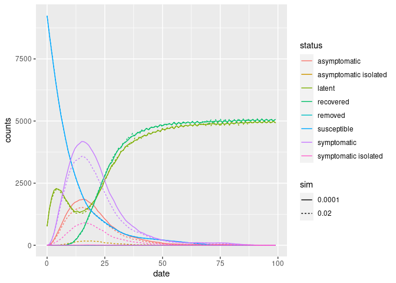
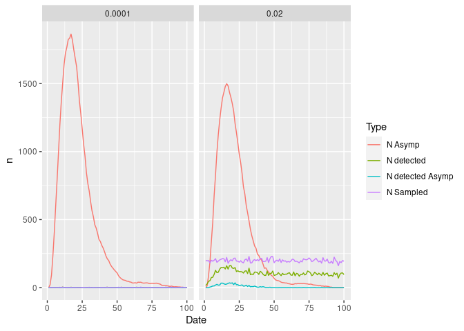

Example with Jay’s Model
================

# Features of this simulation

-   Incubation time of the disease `~ Gamma(3, 1)`
-   Duration of the disease `~Gamma(12, 1)`
-   Probability of becoming symptomatic: 0.9
-   Prob. of transmission: 1.0.
-   Vaccinated population: 25%
-   Vaccine efficacy: .9.
-   Vaccine reduction on transmission: 0.5.
-   Individuals who test positive become isolated.

## Case 1: 0.001 surveillance

``` bash
./jay.o 100 10000 100 .0001
```

    ## 
    ## ________________________________________________________________________________
    ## DEFAULT STATUS CODES
    ## 
    ##   0 = susceptible (S)   *
    ##   6 = recovered (S)     *
    ##   1 = latent (I)        *
    ##   7 = removed (I)       *
    ## 
    ## (S): Susceptible, (I): Infected, (R): Recovered
    ##  * : Baseline status (default)
    ## ________________________________________________________________________________
    ## 
    ## Running the model...
    ## _________________________________________________________________________
    ## ||||||||||||||||||||||||||||||||||||||||||||||||||||||||||||||||||||||||| done.
    ## 
    ## ________________________________________________________________________________
    ## SIMULATION STUDY
    ## 
    ## Population size    : 10000
    ## Days (duration)    : 100 (of 100)
    ## Number of variants : 1
    ## Last run elapsed t : 2.00s
    ## Rewiring           : off
    ## 
    ## Virus(es):
    ##  - unknown virus (baseline prevalence: 100 seeds)
    ## Tool(s):
    ##  - unknown tool (baseline prevalence: 25.00%)
    ## 
    ## Model parameters:
    ##  - Infect period         : 12.0000
    ##  - Latent period         : 3.0000
    ##  - Prob of symptoms      : 0.7000
    ##  - Prob of transmission  : 1.0000
    ##  - Prob. death           : 0.0050
    ##  - Prob. reinfect        : 0.1000
    ##  - Surveilance prob.     : 1.0e-04
    ##  - Vax efficacy          : 0.9000
    ##  - Vax redux transmision : 0.5000
    ## 
    ## Distribution of the population at time 100:
    ##  - Total susceptible (S)           :    9236 -> 0
    ##  - Total recovered (S)             :       0 -> 5071
    ##  - Total latent (I)                :     764 -> 4926
    ##  - Total symptomatic (I)           :       0 -> 0
    ##  - Total symptomatic isolated (I)  :       0 -> 2
    ##  - Total asymptomatic (I)          :       0 -> 1
    ##  - Total asymptomatic isolated (I) :       0 -> 0
    ##  - Total removed (R)               :       0 -> 0
    ## 
    ## (S): Susceptible, (I): Infected, (R): Recovered
    ## ________________________________________________________________________________

``` r
hist1 <- read.csv("jay_hist.txt", sep = " ")
surv1 <- read.csv("jay_user_data.txt", sep = " ")
```

``` bash
./jay.o 100 10000 100 .02
```

    ## 
    ## ________________________________________________________________________________
    ## DEFAULT STATUS CODES
    ## 
    ##   0 = susceptible (S)   *
    ##   6 = recovered (S)     *
    ##   1 = latent (I)        *
    ##   7 = removed (I)       *
    ## 
    ## (S): Susceptible, (I): Infected, (R): Recovered
    ##  * : Baseline status (default)
    ## ________________________________________________________________________________
    ## 
    ## Running the model...
    ## _________________________________________________________________________
    ## ||||||||||||||||||||||||||||||||||||||||||||||||||||||||||||||||||||||||| done.
    ## 
    ## ________________________________________________________________________________
    ## SIMULATION STUDY
    ## 
    ## Population size    : 10000
    ## Days (duration)    : 100 (of 100)
    ## Number of variants : 1
    ## Last run elapsed t : 2.00s
    ## Rewiring           : off
    ## 
    ## Virus(es):
    ##  - unknown virus (baseline prevalence: 100 seeds)
    ## Tool(s):
    ##  - unknown tool (baseline prevalence: 25.00%)
    ## 
    ## Model parameters:
    ##  - Infect period         : 12.0000
    ##  - Latent period         : 3.0000
    ##  - Prob of symptoms      : 0.7000
    ##  - Prob of transmission  : 1.0000
    ##  - Prob. death           : 0.0050
    ##  - Prob. reinfect        : 0.1000
    ##  - Surveilance prob.     : 0.0200
    ##  - Vax efficacy          : 0.9000
    ##  - Vax redux transmision : 0.5000
    ## 
    ## Distribution of the population at time 100:
    ##  - Total susceptible (S)           :    9236 -> 0
    ##  - Total recovered (S)             :       0 -> 5082
    ##  - Total latent (I)                :     764 -> 4824
    ##  - Total symptomatic (I)           :       0 -> 0
    ##  - Total symptomatic isolated (I)  :       0 -> 94
    ##  - Total asymptomatic (I)          :       0 -> 0
    ##  - Total asymptomatic isolated (I) :       0 -> 0
    ##  - Total removed (R)               :       0 -> 0
    ## 
    ## (S): Susceptible, (I): Infected, (R): Recovered
    ## ________________________________________________________________________________

``` r
hist2 <- read.csv("jay_hist.txt", sep = " ")
surv2 <- read.csv("jay_user_data.txt", sep = " ")
hist_comb <- rbind(
  cbind(sim= "0.0001", hist1),
  cbind(sim= "0.02", hist2)
  )
```

``` r
ggplot(hist_comb, aes(x = date, y = counts, colour = status, linetype=sim)) +
  geom_line()
```

<!-- -->

## Cases detected

``` r
survdat <- rbind(
  with(surv1, rbind(
    data.frame(Id = "0.0001", Date = date, Type = "N Sampled",  n = nsampled),
    data.frame(Id = "0.0001", Date = date, Type = "N detected",  n = ndetected),
    data.frame(Id = "0.0001", Date = date, Type = "N detected Asymp",  n = ndetected_asympt),
    data.frame(Id = "0.0001", Date = date, Type = "N Asymp",  n = nasymptomatic)
  )),
  with(surv2, rbind(
    data.frame(Id = "0.02", Date = date, Type = "N Sampled",  n = nsampled),
    data.frame(Id = "0.02", Date = date, Type = "N detected",  n = ndetected),
    data.frame(Id = "0.02", Date = date, Type = "N detected Asymp",  n = ndetected_asympt),
    data.frame(Id = "0.02", Date = date, Type = "N Asymp",  n = nasymptomatic)
  ))
)


ggplot(survdat, aes(x = Date, y = n, colour = Type)) +
  geom_line() +
  facet_wrap(~Id)
```

<!-- -->
