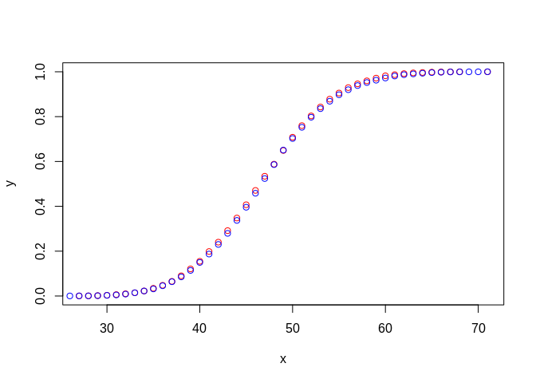
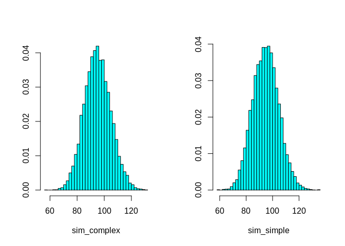
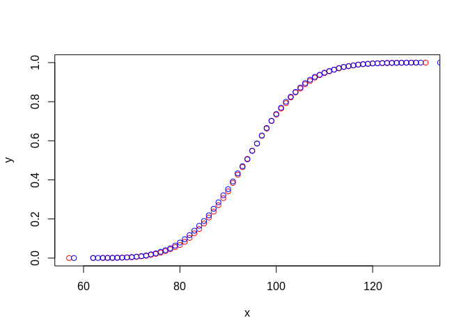

# Mixing probabilities in connected model
George G. Vega Yon, Ph.D.
2024-04-25

## Case 1: No grouping

We will look into the probability of drawing infected individuals to
simplify the algorithm. There are $I$ infected individuals at any time
in the simulation; thus, instead of drawing from $Bern(c/N, N)$, we will
be drawing from $Bern(c/N, I)$. The next step is to check which infected
individuals should be drawn. Let’s compare the distributions using the
hypergeometric as an example:

``` r
set.seed(132)
nsims <- 1e4
N <- 400
rate <- 5
p <- rate/N
I <- 10

sim_complex <- parallel::mclapply(1:nsims, \(i) {
  nsamples <- rbinom(N, N, p)
  sum(rbinom(N, size = nsamples, prob = I/N) > 0)
}, mc.cores = 4L) |> unlist()

sim_simple <- parallel::mclapply(1:nsims, \(i) {
  sum(rbinom(N, I, p) > 0)
}, mc.cores = 4L) |> unlist()


op <- par(mfrow = c(1,2))
MASS::truehist(sim_complex)
MASS::truehist(sim_simple)
```


``` r
par(op)

quantile(sim_complex)
```

      0%  25%  50%  75% 100% 
      27   43   47   51   71 

``` r
quantile(sim_simple)
```

      0%  25%  50%  75% 100% 
      23   43   47   51   71 

``` r
plotter(sim_complex, sim_simple)
```



These two approaches are equivalent, but the second one is more
efficient from the computational perspective.

## Case 2: Grouping

This explores the case when we have mixing across groups. The question
is if we can replicate the effect at the group level.

``` r
set.seed(123133)

ngroups <- 3
mixing <- matrix(
  c(0.1, 0.2, 0.3, 0.2, 0.1, 0.2, 0.3, 0.2, 0.1),
  nrow = ngroups,
  ncol = ngroups
  )

mixing <- mixing/rowSums(mixing)
mixing
```

              [,1]      [,2]      [,3]
    [1,] 0.1666667 0.3333333 0.5000000
    [2,] 0.4000000 0.2000000 0.4000000
    [3,] 0.5000000 0.3333333 0.1666667

``` r
N <- 500
sizes <- c(100, 150, 250)
rate <- 5
p <- rate/N
I <- c(10, 30, 20)

ids <- rep.int(1:ngroups, times = sizes)

nsims <- 1e4

sim_complex <- parallel::mclapply(1:nsims, \(i) {

  # Sampling group first
  sapply(1:ngroups, \(g) {

    # How many each individual will sample from the groups
    ans <- rbinom(
      n = N, size = sizes[g], prob = mixing[ids,][,g] * p
      ) |> sum()

    # Sampling with replacement
    rbinom(ans, size = 1, prob = I[g]/sizes[g]) |> sum()

  }) |> sum()

}, mc.cores = 4L) |> unlist()
```

Using the alternative method in which we directly weight the
probabilities:

``` r
sim_simple <- parallel::mclapply(1:nsims, \(i) {

  # Sampling group first
  sapply(1:ngroups, \(g) {
    rbinom(
      n = N, size = I[g], prob = mixing[cbind(ids,g)] * p
      ) |> sum()
  }) |> sum()

}, mc.cores = 4L) |> unlist()

op <- par(mfrow = c(1,2))
MASS::truehist(sim_complex)
MASS::truehist(sim_simple)
```



``` r
par(op)

quantile(sim_complex)
```

      0%  25%  50%  75% 100% 
      57   88   94  101  131 

``` r
quantile(sim_simple)
```

      0%  25%  50%  75% 100% 
      58   87   94  101  135 

``` r
plotter(sim_complex, sim_simple)
```


