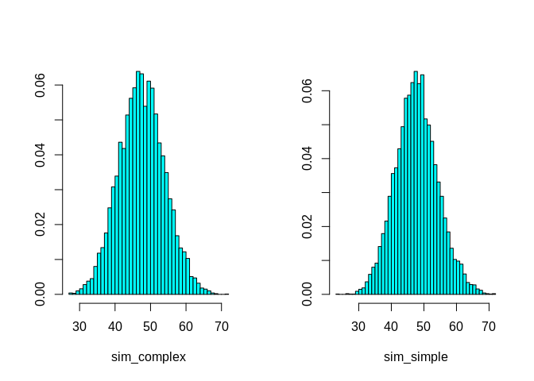

# Mixing probabilities in connected model
George G. Vega Yon, Ph.D.
2024-04-25

We will look into the probability of drawing infected individuals to
simplify the algorithm. There are $I$ infected individuals at any time
in the simulation; thus, instead of drawing from $Bern(c/N, N)$, we will
be drawing from $Bern(c/N, I)$. The next step is to check which infected
individuals should be drawn. Let’s compare the distributions using the
hypergeometric as an example:

``` r
set.seed(132)
nsims <- 1e5
N <- 400
rate <- 2
p <- rate/N
I <- 10

sim_complex <- parallel::mclapply(1:nsims, \(i) {
  nsamples <- rbinom(N, N, p)
  sum(rhyper(N, m = I, n = N, k = nsamples) > 0)
}, mc.cores = 4L) |> unlist()

sim_simple <- parallel::mclapply(1:nsims, \(i) {
  sum(rbinom(N, I, p) > 0) 
}, mc.cores = 4L) |> unlist()


op <- par(mfrow = c(1,2))
MASS::truehist(sim_complex)
MASS::truehist(sim_simple)
```



``` r
par(op)

quantile(sim_complex)
```

      0%  25%  50%  75% 100% 
       3   16   19   22   40 

``` r
quantile(sim_simple)
```

      0%  25%  50%  75% 100% 
       3   17   19   22   40 

These two approaches are equivalent, but the second one is more
efficient from the computational perspective.
