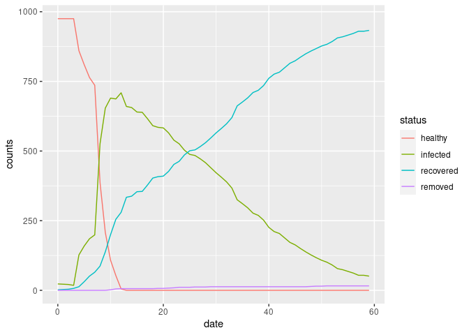

<!-- README.md is generated from README.Rmd. Please edit that file -->

# epiworld

<!-- badges: start -->
<!-- badges: end -->

The goal of epiworld is to …

## Installation

You can install the development version of epiworld from
[GitHub](https://github.com/) with:

``` r
# install.packages("devtools")
devtools::install_github("gvegayon/world-epi")
```

## Example

This is a basic example which shows you how to solve a common problem:

``` r
library(epiworld)
library(igraph)
#> 
#> Attaching package: 'igraph'
#> The following objects are masked from 'package:stats':
#> 
#>     decompose, spectrum
#> The following object is masked from 'package:base':
#> 
#>     union

m <- new_epi_model()
geneseq <- c(T, F, T, T, F)

# Creating tools
add_tool_immune(
  model       = m,
  baselineseq = geneseq,
  preval      = 1,
  efficacy    = .5,
  recovery    = .1
  )

# And the virus
add_virus_covid19(
  model         = m,
  baselineseq   = geneseq,
  preval        = .025,
  mutrate       = 0.0,
  post_immunity = 0.95
  )

# Adding people
set.seed(131)
net   <- igraph::sample_smallworld(1, 10000, 10, .1)
edges <- igraph::as_edgelist(net)

edgelist_from_vec(m, edges[,1], edges[,2], directed = TRUE)

# Virus and tools are distributed
set_rewire_degseq(m, 0.1);
init_epi_model(m, 60, 12)

# We can get information about the model
m
#> Population size    : 10000
#> Days (duration)    : 0 (of 60)
#> Number of variants : 1
#> Rewiring           : on (0.10)
#> 
#> Virus(es):
#>  - COVID19 (baseline prevalence: 0.03)
#> Tool(s):
#>  - Immune system (baseline prevalence: 1.00)
#> 
#> Model parameters:
#>  - covid19 mutation rate : 0.0e+00
#>  - immune death          : 0.0010
#>  - immune efficacy       : 0.5000
#>  - immune recovery       : 0.1000
#>  - immune transm         : 0.9000
#>  - post-covid immunity   : 0.9500
#> 
#> Statistics (susceptible):
#>  - Total healthy   : 9746
#>  - Total recovered : 0
#> 
#> Statistics (infected):
#>  - Total infected  : 254
#> 
#> Statistics (removed):
#>  - Total removed   : 0

# And run the model
run_epi_model(m)
#> Running the model...
#> _________________________________________________________________________
#> ||||||||||||||||||||||||||||||||||||||||||||||||||||||||||||||||||||||||| done.
m
#> Population size    : 10000
#> Days (duration)    : 60 (of 60)
#> Number of variants : 1
#> Rewiring           : on (0.10)
#> 
#> Virus(es):
#>  - COVID19 (baseline prevalence: 0.03)
#> Tool(s):
#>  - Immune system (baseline prevalence: 1.00)
#> 
#> Model parameters:
#>  - covid19 mutation rate : 0.0e+00
#>  - immune death          : 0.0010
#>  - immune efficacy       : 0.5000
#>  - immune recovery       : 0.1000
#>  - immune transm         : 0.9000
#>  - post-covid immunity   : 0.9500
#> 
#> Statistics (susceptible):
#>  - Total healthy   : 0
#>  - Total recovered : 9206
#> 
#> Statistics (infected):
#>  - Total infected  : 608
#> 
#> Statistics (removed):
#>  - Total removed   : 186
```

We can visualize the results

``` r
history <- get_hist_total(m)
head(history)
#>   date    status counts
#> 1    0   healthy   9746
#> 2    0  infected    231
#> 3    0 recovered     22
#> 4    0   removed      1
#> 5    1   healthy   9746
#> 6    1  infected    208

library(ggplot2)
ggplot(history, aes(x = date, y = counts)) +
  geom_line(aes(colour = status)) 
```



## Code of Conduct

Please note that the epiworld project is released with a [Contributor
Code of
Conduct](https://contributor-covenant.org/version/2/0/CODE_OF_CONDUCT.html).
By contributing to this project, you agree to abide by its terms.
