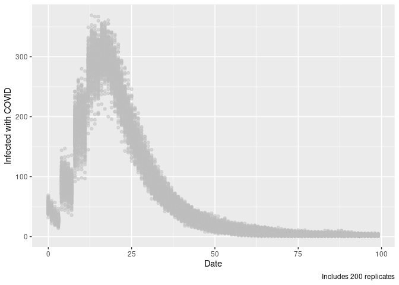

<!-- README.md is generated from README.Rmd. Please edit that file -->

# epiworld

<!-- badges: start -->

<!-- badges: end -->

The goal of epiworld is to …

## Installation

You can install the development version of epiworld from
[GitHub](https://github.com/) with:

``` r
# install.packages("devtools")
devtools::install_github("gvegayon/world-epi")
```

## Example

This is a basic example which shows you how to solve a common problem:

``` r
library(epiworld)
library(igraph)
#> 
#> Attaching package: 'igraph'
#> The following objects are masked from 'package:stats':
#> 
#>     decompose, spectrum
#> The following object is masked from 'package:base':
#> 
#>     union

m <- new_epi_model()
geneseq <- c(T, F, T, T, F)

# Creating tools
add_tool_immune(m, !geneseq, 1)
add_tool_vaccine(m, !geneseq, .5)
add_tool_mask(m, !geneseq, .25)

# And the virus
add_virus_covid19(m, geneseq, .05, mutrate = 0.0)

# Adding people
set.seed(1231)
net   <- igraph::sample_smallworld(1, 1000, 4, .1)
edges <- igraph::as_edgelist(net)

edgelist_from_vec(m, edges[,1], edges[,2], directed = TRUE)

# Virus and tools are distributed
init_epi_model(m, 60, 123)

# We can get information about the model
m
#> Population size   : 1000
#> Days (duration)   : 0 (of 60)
#> Number of variants: 1
#> 
#> Virus(es):
#>  - COVID19 (baseline prevalence: 0.05)
#> Tool(s):
#>  - Immune system (baseline prevalence: 1.00)
#>  - Vaccine (baseline prevalence: 0.50)
#>  - Face masks (baseline prevalence: 0.25)
#> 
#> Statistics:
#>  - Total variants active : 1
#> 
#>  - Total healthy         : 961
#>  - Total infected        : 39
#>  - Total deceased        : 0
#> 
#>  - Total # of recoveries : 0
#> 
#> Model parameters:
#>  - covid19 mutation rate  : 0.0e+00
#>  - immune death           : 0.0010
#>  - immune efficacy        : 0.1000
#>  - immune recovery        : 0.1000
#>  - immune transm          : 0.9000
#>  - mask efficacy          : 0.3000
#>  - mask transm            : 0.1000
#>  - post-covid immunity    : 0.9500
#>  - vax death              : 0.0001
#>  - vax efficacy           : 0.9000
#>  - vax recovery           : 0.4000
#>  - vax transm             : 0.5000

# And run the model
run_epi_model(m)
#> Running the model...
#> _________________________________________________________________________
#> ||||||||||||||||||||||||||||||||||||||||||||||||||||||||||||||||||||||||| done.
m
#> Population size   : 1000
#> Days (duration)   : 60 (of 60)
#> Number of variants: 1
#> 
#> Virus(es):
#>  - COVID19 (baseline prevalence: 0.05)
#> Tool(s):
#>  - Immune system (baseline prevalence: 1.00)
#>  - Vaccine (baseline prevalence: 0.50)
#>  - Face masks (baseline prevalence: 0.25)
#> 
#> Statistics:
#>  - Total variants active : 1
#> 
#>  - Total healthy         : 359
#>  - Total infected        : 619
#>  - Total deceased        : 22
#> 
#>  - Total # of recoveries : 5913
#> 
#> Model parameters:
#>  - covid19 mutation rate  : 0.0e+00
#>  - immune death           : 0.0010
#>  - immune efficacy        : 0.1000
#>  - immune recovery        : 0.1000
#>  - immune transm          : 0.9000
#>  - mask efficacy          : 0.3000
#>  - mask transm            : 0.1000
#>  - post-covid immunity    : 0.9500
#>  - vax death              : 0.0001
#>  - vax efficacy           : 0.9000
#>  - vax recovery           : 0.4000
#>  - vax transm             : 0.5000
```

Can run multiple times (in parallel):

``` r
verbose_off_epi_model(m)

ans <- parallel::mclapply(1:100, function(i) {
  
  # Running and resetting the model
  reset_epi_model(m)
  run_epi_model(m)
  
  # Retrieving the model information
  data.frame(
    replicate  = i,
    date       = get_hist_variant(m, "date"),
    id         = get_hist_variant(m, "id"),
    nrecovered = get_hist_variant(m, "date"),
    ninfected  = get_hist_variant(m, "ninfected"),
    ndeceased  = get_hist_variant(m, "ndeceased")
  )
  
}, mc.cores = 6L)

ans <- do.call(rbind, ans)
```

Visualizing

``` r
library(ggplot2)
ggplot(ans[ans$id == 0,], aes(x = as.integer(date), y = ninfected)) +
  geom_point(alpha = .5, color = "grey") +
  labs(
    x = "Date", y = "Infected with COVID",
    caption = "Includes 100 replicates")
```



## Code of Conduct

Please note that the epiworld project is released with a [Contributor
Code of
Conduct](https://contributor-covenant.org/version/2/0/CODE_OF_CONDUCT.html).
By contributing to this project, you agree to abide by its terms.
